# Story Lifecycle Orchestrator

**Skill:** `bmad-story-lifecycle`  
**Triggers:** "run story lifecycle", "run lifecycle for story [id]", "automate story [id]"

Autonomously drives a story from epic-backlog to **done** through a 13-phase dev+test lifecycle with retry budgets, shared QuickDev fix cycles, and automatic HALT+escalation when budgets are exhausted.

---

## Phase Overview

| # | Tag | Skill Invoked | Exit Criteria |
|---|-----|---------------|---------------|
| 0 | `init` | — | story_key resolved; lifecycle state initialized |
| 1 | `preflight-framework` | `bmad-testarch-framework` *(pre-req)* | `framework-setup-progress.md` + step-05 done |
| 2 | `preflight-test-design` | `bmad-testarch-test-design` | `test-design-epic-N.md` exists + quality gate |
| 3 | `create-story` | `bmad-create-story` | story file exists, status: `ready-for-dev` |
| 4 | `atdd` | `bmad-testarch-atdd` | ≥1 test file exists, all tests **RED** |
| 5 | `validate` | `bmad-check-implementation-readiness` | zero BLOCKERs |
| 6 | `dev-story` | `bmad-dev-story` | DoD gates 1–4 all **GREEN** |
| 7 | `code-review` | `bmad-code-review` | zero BLOCKERs |
| 8 | `test-automate` | `bmad-testarch-automate` | ATDD GREEN + no regressions |
| 9 | `nfr` | `bmad-testarch-nfr` | zero BLOCKERs (perf / security / reliability) |
| 10 | `trace` | `bmad-testarch-trace` | gate: PASS or WAIVED |
| 11 | `test-review` | `bmad-testarch-test-review` | zero BLOCKERs |
| 12 | `done` | — | sprint-status updated |

> **`bmad-testarch-ci`** is a one-time infrastructure setup skill (run once per project), not a per-story phase.

---

## Retry Budgets

| Counter | Max | Scope |
|---------|-----|-------|
| `test_design_retries` | 2 | Test design auto-creation quality gate |
| `atdd_retries` | 2 | ATDD scaffold rework |
| `validate_retries` | 2 | Readiness spec gap fixes |
| `dev_retries` | 2 | DoD gate failures |
| `code_review_retries` | 1 | Code review BLOCKER fixes |
| `nfr_retries` | 2 | NFR BLOCKER fixes |
| `trace_retries` | 2 | Traceability gap coverage additions |
| `quickdev_cycle` | 2 | **Shared** across code-review / test-automate / nfr / test-review fix cycles |

When `quickdev_cycle > 2` the lifecycle **HALTS** and escalates to the user regardless of which phase triggered it.

### Fix Cycle Re-entry Rule

When `test-review` triggers a code fix and sends flow back to `test-automate`, the phases `test-automate`, `nfr`, and `trace` are removed from `phases_completed` to force full re-execution of all three.

---

## Workflow Diagram

```mermaid
flowchart TD
    START(["▶ run story lifecycle"]) --> INIT

    subgraph PH0["⓪ INIT"]
        direction TB
        INIT["Resolve story_key\nfrom input / epic / sprint-status.yaml"]
        INIT_EXISTS{"lifecycle-state\nexists?"}
        INIT_NEW["Write new lifecycle state\ncurrent_phase: preflight-framework"]
        INIT_RESUME["Load state\njump to current_phase"]
    end
    INIT --> INIT_EXISTS
    INIT_EXISTS -->|no| INIT_NEW --> PH1A
    INIT_EXISTS -->|yes| INIT_RESUME -.->|resume| PH1A

    subgraph PH1["① PREFLIGHT — Framework"]
        direction TB
        PH1A["Read framework-setup-progress.md"]
        PH1A_OK{"step-05\ncompleted?"}
        PH1A_PASS["✅ Framework confirmed"]
        PH1A_HALT(["🚫 HALT\nRun bmad-testarch-framework"])
    end
    PH1A --> PH1A_OK
    PH1A_OK -->|yes| PH1A_PASS --> PH2A
    PH1A_OK -->|no| PH1A_HALT

    subgraph PH2["② PREFLIGHT — Test Design"]
        direction TB
        PH2A["Search test-design-epic-N.md\nin _bmad-output/test-artifacts/"]
        PH2A_OK{"valid + quality\ngate pass?"}
        PH2A_CREATE["bmad-testarch-test-design\nCreate mode"]
        PH2A_QG{"quality\ngate pass?"}
        PH2A_RETRY{"test_design_retries\n< 2?"}
        PH2A_PASS["✅ Test design confirmed"]
        PH2A_HALT(["🚫 HALT\nmanual fix required"])
    end
    PH2A --> PH2A_OK
    PH2A_OK -->|yes| PH2A_PASS --> PH3A
    PH2A_OK -->|no| PH2A_CREATE --> PH2A_QG
    PH2A_QG -->|pass| PH2A_PASS
    PH2A_QG -->|fail| PH2A_RETRY
    PH2A_RETRY -->|yes| PH2A_CREATE
    PH2A_RETRY -->|no| PH2A_HALT

    subgraph PH3["③ CREATE STORY"]
        direction TB
        PH3A{"story file\nexists + ready?"}
        PH3A_CREATE["bmad-create-story"]
        PH3A_PASS["✅ Story created\nstatus: ready-for-dev"]
    end
    PH3A -->|yes| PH3A_PASS --> PH4A
    PH3A -->|no| PH3A_CREATE --> PH3A_PASS

    subgraph PH4["④ ATDD — Red Phase"]
        direction TB
        PH4A["bmad-testarch-atdd\nCreate mode"]
        PH4A_OK{"≥1 test file\nall tests RED?"}
        PH4A_RETRY{"atdd_retries\n< 2?"}
        PH4A_FIX["Fix scaffolds"]
        PH4A_PASS["✅ ATDD scaffolds RED confirmed"]
        PH4A_HALT(["🚫 HALT\nmanual spec review required"])
    end
    PH4A --> PH4A_OK
    PH4A_OK -->|yes| PH4A_PASS --> PH5A
    PH4A_OK -->|no| PH4A_RETRY
    PH4A_RETRY -->|yes| PH4A_FIX --> PH4A
    PH4A_RETRY -->|no| PH4A_HALT

    subgraph PH5["⑤ VALIDATE"]
        direction TB
        PH5A["bmad-check-implementation-readiness"]
        PH5A_OK{"zero\nBLOCKERs?"}
        PH5A_RETRY{"validate_retries\n< 2?"}
        PH5A_FIX["Fix story spec\nmissing ACs / ambiguous tasks"]
        PH5A_PASS["✅ Story implementation-ready"]
        PH5A_HALT(["🚫 HALT\nmanual story refinement required"])
    end
    PH5A --> PH5A_OK
    PH5A_OK -->|yes| PH5A_PASS --> PH6A
    PH5A_OK -->|no| PH5A_RETRY
    PH5A_RETRY -->|yes| PH5A_FIX --> PH5A
    PH5A_RETRY -->|no| PH5A_HALT

    subgraph PH6["⑥ DEV STORY"]
        direction TB
        PH6A["bmad-dev-story"]
        PH6A_DOD{"DoD Gates 1–4\n① dotnet test  ② npm build\n③ dotnet build  ④ ATDD GREEN"}
        PH6A_RETRY{"dev_retries\n< 2?"}
        PH6A_FIX["Targeted fix\nno full re-run"]
        PH6A_PASS["✅ Implementation done\nAll DoD gates GREEN"]
        PH6A_HALT(["🚫 HALT\nescalate to user"])
    end
    PH6A --> PH6A_DOD
    PH6A_DOD -->|all pass| PH6A_PASS --> PH7A
    PH6A_DOD -->|fail| PH6A_RETRY
    PH6A_RETRY -->|yes| PH6A_FIX --> PH6A_DOD
    PH6A_RETRY -->|no| PH6A_HALT

    subgraph PH7["⑦ CODE REVIEW"]
        direction TB
        PH7A["bmad-code-review\nstory diff scope"]
        PH7A_OK{"zero\nBLOCKERs?"}
        PH7A_QD{"code_review_retries < 1\nAND quickdev_cycle < 2?"}
        PH7A_FIX["bmad-quick-dev\nVerify DoD gates 1–4"]
        PH7A_PASS["✅ Code review clean"]
        PH7A_HALT(["🚫 HALT\nescalate to user"])
    end
    PH7A --> PH7A_OK
    PH7A_OK -->|yes| PH7A_PASS --> PH8A
    PH7A_OK -->|no| PH7A_QD
    PH7A_QD -->|yes| PH7A_FIX --> PH7A
    PH7A_QD -->|no| PH7A_HALT

    subgraph PH8["⑧ TEST AUTOMATE"]
        direction TB
        PH8A["bmad-testarch-automate\nCreate mode — story scope"]
        PH8A_OK{"all ATDD GREEN\nno regressions?"}
        PH8A_QD{"quickdev_cycle\n< 2?"}
        PH8A_FIX["bmad-quick-dev fix\nRe-run brief code review"]
        PH8A_PASS["✅ Coverage expanded\nAll tests GREEN"]
        PH8A_HALT(["🚫 HALT\nescalate to user"])
    end
    PH8A --> PH8A_OK
    PH8A_OK -->|yes| PH8A_PASS --> PH9A
    PH8A_OK -->|no| PH8A_QD
    PH8A_QD -->|yes| PH8A_FIX --> PH8A
    PH8A_QD -->|no| PH8A_HALT

    subgraph PH9["⑨ NFR AUDIT"]
        direction TB
        PH9A["bmad-testarch-nfr\nperf · security · reliability"]
        PH9A_OK{"zero\nBLOCKERs?"}
        PH9A_QD{"nfr_retries < 2\nAND quickdev_cycle < 2?"}
        PH9A_FIX["bmad-quick-dev fix\nVerify DoD gates 1–4"]
        PH9A_PASS["✅ NFR evidence audited"]
        PH9A_HALT(["🚫 HALT\nescalate to user"])
    end
    PH9A --> PH9A_OK
    PH9A_OK -->|yes| PH9A_PASS --> PH10A
    PH9A_OK -->|no| PH9A_QD
    PH9A_QD -->|yes| PH9A_FIX --> PH9A
    PH9A_QD -->|no| PH9A_HALT

    subgraph PH10["⑩ TRACEABILITY"]
        direction TB
        PH10A["bmad-testarch-trace\nreq → test matrix"]
        PH10A_OK{"gate: PASS\nor WAIVED?"}
        PH10A_RETRY{"trace_retries\n< 2?"}
        PH10A_FIX["Add missing test coverage\nclose traceability gaps"]
        PH10A_PASS["✅ Traceability gate passed"]
        PH10A_HALT(["🚫 HALT\nescalate to user"])
    end
    PH10A --> PH10A_OK
    PH10A_OK -->|yes| PH10A_PASS --> PH11A
    PH10A_OK -->|no| PH10A_RETRY
    PH10A_RETRY -->|yes| PH10A_FIX --> PH10A
    PH10A_RETRY -->|no| PH10A_HALT

    subgraph PH11["⑪ TEST REVIEW"]
        direction TB
        PH11A["bmad-testarch-test-review\nstory scope"]
        PH11A_OK{"zero\nBLOCKERs?"}
        PH11A_CODE{"code changes\nrequired?"}
        PH11A_QD{"quickdev_cycle\n< 2?"}
        PH11A_FIX_CODE["bmad-quick-dev\nClear test-automate + nfr + trace\nfrom phases_completed"]
        PH11A_FIX_TEST["Fix test logic directly\nassertions / edge cases"]
        PH11A_PASS["✅ Test quality approved"]
        PH11A_HALT(["🚫 HALT\nescalate to user"])
    end
    PH11A --> PH11A_OK
    PH11A_OK -->|yes| PH11A_PASS --> PH12A
    PH11A_OK -->|no| PH11A_CODE
    PH11A_CODE -->|yes| PH11A_QD
    PH11A_QD -->|yes| PH11A_FIX_CODE --> PH8A
    PH11A_QD -->|no| PH11A_HALT
    PH11A_CODE -->|no| PH11A_FIX_TEST --> PH11A

    subgraph PH12["⑫ DONE"]
        direction TB
        PH12A["sprint-status → done\nlifecycle-state → done"]
        PH12B{"all epic\nstories done?"}
        PH12C["epic status → done"]
        PH12D(["✅ Story DONE"])
    end
    PH12A --> PH12B
    PH12B -->|yes| PH12C --> PH12D
    PH12B -->|no| PH12D

    style PH1A_HALT fill:#c62828,color:#fff,stroke:#b71c1c
    style PH2A_HALT fill:#c62828,color:#fff,stroke:#b71c1c
    style PH4A_HALT fill:#c62828,color:#fff,stroke:#b71c1c
    style PH5A_HALT fill:#c62828,color:#fff,stroke:#b71c1c
    style PH6A_HALT fill:#c62828,color:#fff,stroke:#b71c1c
    style PH7A_HALT fill:#c62828,color:#fff,stroke:#b71c1c
    style PH8A_HALT fill:#c62828,color:#fff,stroke:#b71c1c
    style PH9A_HALT fill:#c62828,color:#fff,stroke:#b71c1c
    style PH10A_HALT fill:#c62828,color:#fff,stroke:#b71c1c
    style PH11A_HALT fill:#c62828,color:#fff,stroke:#b71c1c
    style START fill:#1565c0,color:#fff,stroke:#0d47a1
    style PH12D fill:#2e7d32,color:#fff,stroke:#1b5e20
```



---

## Lifecycle State File

Written to `{implementation_artifacts}/lifecycle-state-{story_key}.yaml` after every phase transition. Enables safe resume after interruption.

```yaml
story_key: ""
epic_id: ""
current_phase: ""          # phase tag (see Phase Tags above)
status: active             # active | blocked | done
blocked_reason: ""
test_design_retries: 0
test_design_auto_created: false
atdd_retries: 0
validate_retries: 0
dev_retries: 0
code_review_retries: 0
nfr_retries: 0
trace_retries: 0
quickdev_cycle: 0          # shared budget across all fix cycles
last_updated: ""
phases_completed: []
```
