# Story Lifecycle Orchestrator

**Skill:** `bmad-story-lifecycle`
**Triggers:** "run story lifecycle", "run lifecycle for story [id]", "automate story [id]"
**Targets:** Claude Code (`.agents/skills/bmad-story-lifecycle/SKILL.md`) and GitHub Copilot (`.github/agents/bmad-story-lifecycle.agent.md`, a thin pointer to the same SKILL.md).

Autonomously drives a story from epic-backlog to **done** through a 13-phase dev+test lifecycle with retry budgets, a shared QuickDev fix-cycle budget, automatic HALT+escalation when budgets are exhausted, and (via the committed team override) release-branch management, an E2E test gate, and a CHANGELOG/commit/push done-phase.

---

## Phase Overview

Phase order: `create-story → validate → atdd → dev-story` (validate runs **before** ATDD — the story spec is confirmed ready before tests are scaffolded against it).

| # | Tag | Skill Invoked | Execution | Model | Exit Criteria |
|---|-----|---------------|-----------|-------|---------------|
| 0 | `init` | — | inline | Opus | story_key resolved; lifecycle state initialized |
| 1 | `preflight-framework` | `bmad-testarch-framework` *(pre-req)* | inline | Opus | `framework-setup-progress.md` + step-05 done |
| 2 | `preflight-test-design` | `bmad-testarch-test-design` | subagent | Opus | `test-design-epic-N.md` exists + quality gate |
| 3 | `create-story` | `bmad-create-story` | subagent | Opus | story file exists, status: `ready-for-dev` |
| 4 | `validate` | `bmad-check-implementation-readiness` | inline | Opus | zero BLOCKERs |
| 5 | `atdd` | `bmad-testarch-atdd` | subagent | Sonnet | ≥1 test file exists, all tests **RED** |
| 6 | `dev-story` | `bmad-dev-story` | subagent | Sonnet | DoD gates 1–4 all **GREEN** |
| 7 | `code-review` | `bmad-code-review` | subagent | Opus | zero BLOCKERs |
| 8 | `test-automate` | `bmad-testarch-automate` | subagent | Sonnet | ATDD GREEN + no regressions + **E2E gate** |
| 9 | `nfr` | `bmad-testarch-nfr` | subagent | Opus | zero BLOCKERs (perf / security / reliability) |
| 10 | `trace` | `bmad-testarch-trace` | subagent | Opus | gate: PASS or WAIVED |
| 11 | `test-review` | `bmad-testarch-test-review` | subagent | Opus | zero BLOCKERs |
| 12 | `done` | — *(+ team-override done phase)* | inline | Opus | sprint-status/releases updated, CHANGELOG, commit, push |

> **`bmad-testarch-ci`** is a one-time infrastructure setup skill (run once per project), not a per-story phase.

---

## Skills & Roles

| Skill | Role in the lifecycle |
|-------|------------------------|
| `bmad-testarch-framework` | Test framework scaffold (Playwright + xUnit) — preflight pre-req |
| `bmad-testarch-test-design` | Epic-level test strategy / risk assessment — preflight |
| `bmad-create-story` | Story context engine — authors the implementation-ready story file |
| `bmad-check-implementation-readiness` | Gatekeeper — confirms the story spec has no blockers before coding |
| `bmad-testarch-atdd` | Writes red-phase acceptance tests against the ACs |
| `bmad-dev-story` | Senior engineer — implements the story to pass the DoD gates |
| `bmad-code-review` | Adversarial reviewer — Blind Hunter / Edge-Case Hunter / Acceptance Auditor |
| `bmad-testarch-automate` | Expands automated coverage on new code paths |
| `bmad-testarch-nfr` | Audits NFR evidence (performance, security, reliability, maintainability) |
| `bmad-testarch-trace` | Builds the AC→test traceability matrix + coverage gate |
| `bmad-testarch-test-review` | Reviews test quality (assertions, determinism, anti-patterns) |
| `bmad-quick-dev` | Targeted fix engine used inside QuickDev fix cycles |

---

## Execution Strategy (Hybrid)

The orchestrator uses a **hybrid** execution model with **per-task model selection**:

- **Inline** (orchestrator context): lightweight state transitions, file checks, readiness reasoning, and the changelog/commit done-phase — these benefit from full conversational context.
- **Subagent** (dispatched, isolated context): heavy self-contained skills, so each keeps its own context window and returns only a structured gate result.
- **Model:** **Claude Sonnet (latest)** for coding tasks (atdd, dev-story, test-automate, quick-dev); **Claude Opus (latest)** for reasoning/analysis/writing tasks (test-design, create-story, validate, code-review, nfr, trace, test-review, done) — more thinking budget where judgement matters.

E2E / container-dependent test runs first load [`docs/testing/test-environment.md`](../../../docs/testing/test-environment.md) and require the Fishtank stack healthy at `http://localhost:5000` (WSL2 + Docker Desktop via the support tool).

---

## Retry Budgets

| Counter | Max | Scope |
|---------|-----|-------|
| `test_design_retries` | 2 | Test design auto-creation quality gate |
| `validate_retries` | 2 | Readiness spec gap fixes |
| `atdd_retries` | 2 | ATDD scaffold rework |
| `dev_retries` | 2 | DoD gate failures |
| `code_review_retries` | 1 | Code review BLOCKER fixes |
| `nfr_retries` | 2 | NFR BLOCKER fixes |
| `trace_retries` | 2 | Traceability gap coverage additions |
| `quickdev_cycle` | 2 | **Shared** across code-review / test-automate / nfr / test-review / E2E fix cycles |

When `quickdev_cycle > 2` the lifecycle **HALTS** and escalates regardless of which phase triggered it.

### Fix Cycle Re-entry Rule

When `test-review` triggers a code fix and sends flow back to `test-automate`, the phases `test-automate`, `nfr`, and `trace` are removed from `phases_completed` to force full re-execution of all three.

---

## Team Override Augmentations (committed `_bmad/custom/bmad-story-lifecycle.toml`)

- **Release-branch management** (before preflight-test-design): maps epic → release version via `releases.yaml`, creates/uses `release/vX.Y.Z`, branches `story/<key>` from it, opens the `[Unreleased]` CHANGELOG section on the first story of a release.
- **E2E test gate** (end of test-automate): if a `story-<key>.spec.ts` exists, requires `/health` = 200 then runs Playwright; failures enter the shared QuickDev fix cycle. See `docs/testing/test-environment.md`.
- **Done phase**: sets sprint-status + releases.yaml to `done`, appends CHANGELOG bullets (versions the header on the last story of a release), composes a Conventional Commit, and pushes `story/<key>`.

> The team override is loaded via `persistent_facts` + `activation_steps_append`. It must be valid UTF-8 **without a BOM** (the resolver uses `tomllib`, which rejects a BOM).

---

## Workflow Diagram

```mermaid
flowchart TD
    START(["▶ run story lifecycle"]) --> INIT

    subgraph PH0["⓪ INIT"]
        direction TB
        INIT["Resolve story_key\nfrom input / epic / sprint-status.yaml"]
        INIT_EXISTS{"lifecycle-state\nexists?"}
        INIT_NEW["Write new lifecycle state\ncurrent_phase: preflight-framework"]
        INIT_RESUME["Load state\njump to current_phase"]
    end
    INIT --> INIT_EXISTS
    INIT_EXISTS -->|no| INIT_NEW --> PH1A
    INIT_EXISTS -->|yes| INIT_RESUME -.->|resume| PH1A

    subgraph PH1["① PREFLIGHT — Framework · inline · Opus"]
        direction TB
        PH1A["Read framework-setup-progress.md"]
        PH1A_OK{"step-05\ncompleted?"}
        PH1A_PASS["✅ Framework confirmed"]
        PH1A_HALT(["🚫 HALT — run bmad-testarch-framework"])
    end
    PH1A --> PH1A_OK
    PH1A_OK -->|yes| PH1A_PASS --> PH2A
    PH1A_OK -->|no| PH1A_HALT

    subgraph PH2["② PREFLIGHT — Test Design · subagent · Opus"]
        direction TB
        PH2A["test-design-epic-N.md\n(bmad-testarch-test-design)"]
        PH2A_OK{"valid + quality\ngate pass?"}
        PH2A_PASS["✅ Test design confirmed"]
        PH2A_HALT(["🚫 HALT — retries exhausted"])
    end
    PH2A --> PH2A_OK
    PH2A_OK -->|yes / created| PH2A_PASS --> PH3A
    PH2A_OK -->|fail x3| PH2A_HALT

    subgraph PH3["③ CREATE STORY · subagent · Opus"]
        direction TB
        PH3A["bmad-create-story"]
        PH3A_PASS["✅ Story ready-for-dev"]
    end
    PH3A --> PH3A_PASS --> PH4A

    subgraph PH4["④ VALIDATE · inline · Opus"]
        direction TB
        PH4A["bmad-check-implementation-readiness"]
        PH4A_OK{"zero\nBLOCKERs?"}
        PH4A_FIX["Fix story spec\n(retry ≤ 2)"]
        PH4A_PASS["✅ Story implementation-ready"]
        PH4A_HALT(["🚫 HALT — manual refinement"])
    end
    PH4A --> PH4A_OK
    PH4A_OK -->|yes| PH4A_PASS --> PH5A
    PH4A_OK -->|no, retry| PH4A_FIX --> PH4A
    PH4A_OK -->|no, exhausted| PH4A_HALT

    subgraph PH5["⑤ ATDD — Red Phase · subagent · Sonnet"]
        direction TB
        PH5A["bmad-testarch-atdd (Create)"]
        PH5A_OK{"≥1 test file\nall RED?"}
        PH5A_FIX["Fix scaffolds\n(retry ≤ 2)"]
        PH5A_PASS["✅ ATDD scaffolds RED + checklist saved"]
        PH5A_HALT(["🚫 HALT — spec review"])
    end
    PH5A --> PH5A_OK
    PH5A_OK -->|yes| PH5A_PASS --> PH6A
    PH5A_OK -->|no, retry| PH5A_FIX --> PH5A
    PH5A_OK -->|no, exhausted| PH5A_HALT

    subgraph PH6["⑥ DEV STORY · subagent · Sonnet"]
        direction TB
        PH6A["bmad-dev-story"]
        PH6A_DOD{"DoD 1–4\n① dotnet test ② npm build\n③ dotnet build ④ ATDD GREEN"}
        PH6A_FIX["Targeted fix (retry ≤ 2)"]
        PH6A_PASS["✅ Implementation GREEN"]
        PH6A_HALT(["🚫 HALT — escalate"])
    end
    PH6A --> PH6A_DOD
    PH6A_DOD -->|all pass| PH6A_PASS --> PH7A
    PH6A_DOD -->|fail, retry| PH6A_FIX --> PH6A_DOD
    PH6A_DOD -->|fail, exhausted| PH6A_HALT

    subgraph PH7["⑦ CODE REVIEW · subagent · Opus"]
        direction TB
        PH7A["bmad-code-review (story diff)"]
        PH7A_OK{"zero\nBLOCKERs?"}
        PH7A_FIX["bmad-quick-dev (Sonnet)\nverify DoD 1–4"]
        PH7A_PASS["✅ Review clean"]
        PH7A_HALT(["🚫 HALT — escalate"])
    end
    PH7A --> PH7A_OK
    PH7A_OK -->|yes| PH7A_PASS --> PH8A
    PH7A_OK -->|no, budget| PH7A_FIX --> PH7A
    PH7A_OK -->|no, exhausted| PH7A_HALT

    subgraph PH8["⑧ TEST AUTOMATE + E2E GATE · subagent · Sonnet"]
        direction TB
        PH8A["bmad-testarch-automate (Create)\n+ automation-summary saved"]
        PH8A_OK{"ATDD GREEN\nno regressions?"}
        PH8E{"E2E gate:\n/health 200 + spec green?"}
        PH8A_FIX["bmad-quick-dev (Sonnet)"]
        PH8A_PASS["✅ Coverage expanded + E2E green"]
        PH8A_HALT(["🚫 HALT — escalate / app down"])
    end
    PH8A --> PH8A_OK
    PH8A_OK -->|yes| PH8E
    PH8A_OK -->|no, budget| PH8A_FIX --> PH8A
    PH8A_OK -->|no, exhausted| PH8A_HALT
    PH8E -->|yes / waived→CI| PH8A_PASS --> PH9A
    PH8E -->|fail, budget| PH8A_FIX
    PH8E -->|app down| PH8A_HALT

    subgraph PH9["⑨ NFR AUDIT · subagent · Opus"]
        direction TB
        PH9A["bmad-testarch-nfr\nperf · security · reliability"]
        PH9A_OK{"zero\nBLOCKERs?"}
        PH9A_FIX["bmad-quick-dev (Sonnet)"]
        PH9A_PASS["✅ NFR audited + assessment saved"]
        PH9A_HALT(["🚫 HALT — escalate"])
    end
    PH9A --> PH9A_OK
    PH9A_OK -->|yes| PH9A_PASS --> PH10A
    PH9A_OK -->|no, budget| PH9A_FIX --> PH9A
    PH9A_OK -->|no, exhausted| PH9A_HALT

    subgraph PH10["⑩ TRACEABILITY · subagent · Opus"]
        direction TB
        PH10A["bmad-testarch-trace\nreq → test matrix"]
        PH10A_OK{"gate: PASS\nor WAIVED?"}
        PH10A_FIX["Add coverage (retry ≤ 2)"]
        PH10A_PASS["✅ Traceability gate passed"]
        PH10A_HALT(["🚫 HALT — escalate"])
    end
    PH10A --> PH10A_OK
    PH10A_OK -->|yes| PH10A_PASS --> PH11A
    PH10A_OK -->|no, retry| PH10A_FIX --> PH10A
    PH10A_OK -->|no, exhausted| PH10A_HALT

    subgraph PH11["⑪ TEST REVIEW · subagent · Opus"]
        direction TB
        PH11A["bmad-testarch-test-review"]
        PH11A_OK{"zero\nBLOCKERs?"}
        PH11A_CODE{"code changes\nrequired?"}
        PH11A_FIX_CODE["bmad-quick-dev (Sonnet)\nclear test-automate+nfr+trace"]
        PH11A_FIX_TEST["Fix test logic directly"]
        PH11A_PASS["✅ Test quality approved"]
        PH11A_HALT(["🚫 HALT — escalate"])
    end
    PH11A --> PH11A_OK
    PH11A_OK -->|yes| PH11A_PASS --> PH12A
    PH11A_OK -->|no| PH11A_CODE
    PH11A_CODE -->|yes, budget| PH11A_FIX_CODE --> PH8A
    PH11A_CODE -->|yes, exhausted| PH11A_HALT
    PH11A_CODE -->|no| PH11A_FIX_TEST --> PH11A

    subgraph PH12["⑫ DONE · inline · Opus"]
        direction TB
        PH12A["sprint-status + releases.yaml → done\nCHANGELOG bullets · commit · push"]
        PH12B{"all epic\nstories done?"}
        PH12C["release → ready-for-merge\nversion CHANGELOG header"]
        PH12D(["✅ Story DONE"])
    end
    PH12A --> PH12B
    PH12B -->|yes| PH12C --> PH12D
    PH12B -->|no| PH12D

    style START fill:#1565c0,color:#fff,stroke:#0d47a1
    style PH12D fill:#2e7d32,color:#fff,stroke:#1b5e20
    style PH1A_HALT fill:#c62828,color:#fff,stroke:#b71c1c
    style PH2A_HALT fill:#c62828,color:#fff,stroke:#b71c1c
    style PH4A_HALT fill:#c62828,color:#fff,stroke:#b71c1c
    style PH5A_HALT fill:#c62828,color:#fff,stroke:#b71c1c
    style PH6A_HALT fill:#c62828,color:#fff,stroke:#b71c1c
    style PH7A_HALT fill:#c62828,color:#fff,stroke:#b71c1c
    style PH8A_HALT fill:#c62828,color:#fff,stroke:#b71c1c
    style PH9A_HALT fill:#c62828,color:#fff,stroke:#b71c1c
    style PH10A_HALT fill:#c62828,color:#fff,stroke:#b71c1c
    style PH11A_HALT fill:#c62828,color:#fff,stroke:#b71c1c
```



---

## Lifecycle State File

Written to `{implementation_artifacts}/lifecycle-state-{story_key}.yaml` after every phase transition. Enables safe resume after interruption.

```yaml
story_key: ""
epic_id: ""
current_phase: ""          # phase tag (see Phase Overview above)
status: active             # active | blocked | done
blocked_reason: ""
test_design_retries: 0
test_design_auto_created: false
validate_retries: 0
atdd_retries: 0
dev_retries: 0
code_review_retries: 0
nfr_retries: 0
trace_retries: 0
quickdev_cycle: 0          # shared budget across all fix cycles
last_updated: ""
phases_completed: []
```

---

## Per-story artifacts (persisted to disk, with verify gates)

Each is verified-on-disk before the phase advances (the orchestrator re-saves if missing, HALTs if it cannot persist):

| Artifact | Phase | Path |
|----------|-------|------|
| `atdd-checklist-{key}.md` | atdd | `_bmad-output/test-artifacts/` |
| `automation-summary-{key}.md` | test-automate | `_bmad-output/test-artifacts/` |
| `nfr-assessment-{key}.md` | nfr | `_bmad-output/test-artifacts/` |
| `traceability-matrix-{key}.md` | trace | `_bmad-output/test-artifacts/` |
