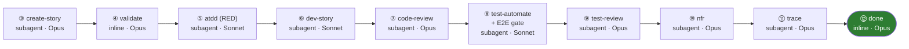

# GitHub Copilot Agents — BMAD for Fishtank

This folder holds **GitHub Copilot custom agents** (`*.agent.md`). Each file is a **thin pointer**:
its front-matter `description` drives Copilot's agent picker, and its body instructs Copilot to load
the canonical skill definition under [`/.agents/skills/`](../../.agents/skills/) and follow it exactly.

```
---
description: <when to use this agent>
---

LOAD the FULL {project-root}/.agents/skills/<name>/SKILL.md, READ its entire contents and follow its directions exactly!
```

> **Single source of truth:** the workflow logic lives once in `/.agents/skills/<name>/SKILL.md`.
> Claude Code consumes those skills natively; GitHub Copilot consumes them through the pointers here.
> When you change a SKILL.md, both assistants pick up the change — only update a pointer if the
> skill's name or one-line description changes.

---

## The story dev+test lifecycle

The headline agent is **`bmad-story-lifecycle`** — it autonomously drives a story from backlog to
**done** through a 13-phase dev+test pipeline. Invoke it in Copilot Chat and say
*"run story lifecycle"* (optionally with a story id).

Phase order: `create-story → validate → atdd → dev-story` (the story spec is validated **before**
acceptance tests are scaffolded against it).



> Preflight phases ① framework + ② test-design run before ③ create-story. Fix cycles
> (`bmad-quick-dev`, Sonnet) can loop back from code-review / test-automate / nfr / test-review under
> a shared budget of 2. Full diagram, retry budgets, and state schema:
> [`/.agents/skills/bmad-story-lifecycle/README.md`](../../.agents/skills/bmad-story-lifecycle/README.md).

---

## Workflow agents in this folder

| Copilot agent | Skill | Role | Execution | Model |
|---------------|-------|------|-----------|-------|
| `bmad-story-lifecycle` | story-lifecycle orchestrator | Drives the full dev+test pipeline | orchestrator | — |
| `bmad-testarch-framework` | framework scaffold | Playwright + xUnit setup (one-time) | subagent | Opus |
| `bmad-testarch-test-design` | test strategy | Epic-level risk + coverage plan | subagent | Opus |
| `bmad-create-story` | story context engine | Author implementation-ready story | subagent | Opus |
| `bmad-create-story` (validate action) | readiness gate | Validate story spec via checklist — zero BLOCKERs | inline | Opus |
| `bmad-testarch-atdd` | ATDD | Red-phase acceptance tests | subagent | Sonnet |
| `bmad-dev-story` | dev | Implement the story (DoD gates) | subagent | Sonnet |
| `bmad-code-review` | reviewer | Adversarial multi-lens review | subagent | Opus |
| `bmad-testarch-automate` | automation | Expand coverage + E2E gate | subagent | Sonnet |
| `bmad-testarch-test-review` | test quality | Review test assertions/determinism | subagent | Opus |
| `bmad-testarch-nfr` | NFR audit | Perf / security / reliability evidence | subagent | Opus |
| `bmad-testarch-trace` | traceability | AC→test matrix + gate | subagent | Opus |
| `bmad-quick-dev` | fix engine | Targeted fixes in QuickDev cycles | subagent | Sonnet |

**Persona agents** also present here (talk-to-the-role entry points): `bmad-agent-dev` (Amelia),
`bmad-tea` (Murat), `bmad-agent-architect`, `bmad-agent-pm`, `bmad-agent-analyst`,
`bmad-agent-tech-writer`, `bmad-agent-ux-designer`, and the CIS coaches.

---

## Execution & model strategy (hybrid)

- **Inline vs subagent:** lightweight reasoning/state steps run inline in the orchestrator; heavy
  self-contained skills run as dispatched subagents with isolated context returning a structured
  gate result.
- **Model:** **Claude Sonnet (latest)** for coding tasks (atdd, dev-story, test-automate, quick-dev);
  **Claude Opus (latest)** for reasoning/analysis/writing tasks (test-design, create-story, validate,
  code-review, nfr, trace, test-review, done).

---

## Test environment

E2E / container-dependent tests require the Fishtank stack healthy at `http://localhost:5000`
(WSL2 + Docker Desktop, via the support tool). See
[`/docs/testing/test-environment.md`](../../docs/testing/test-environment.md). The lifecycle's E2E
gate hard-blocks if the stack is not running.
