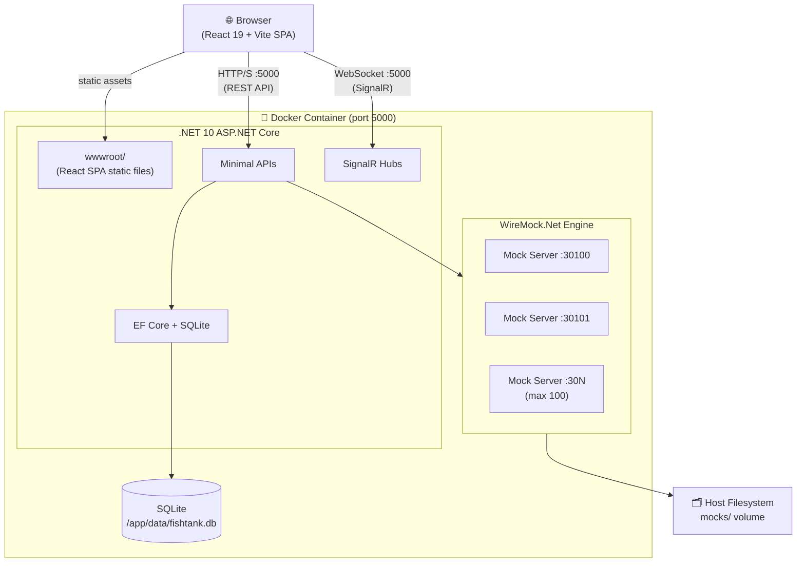
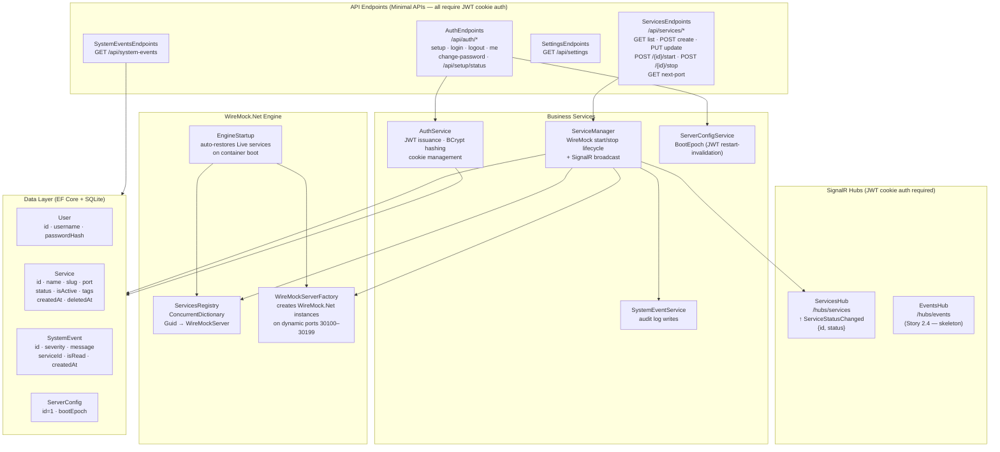
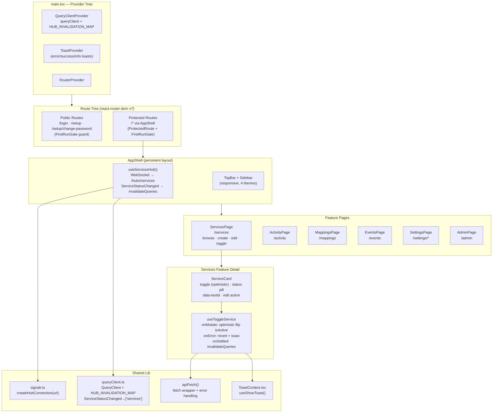
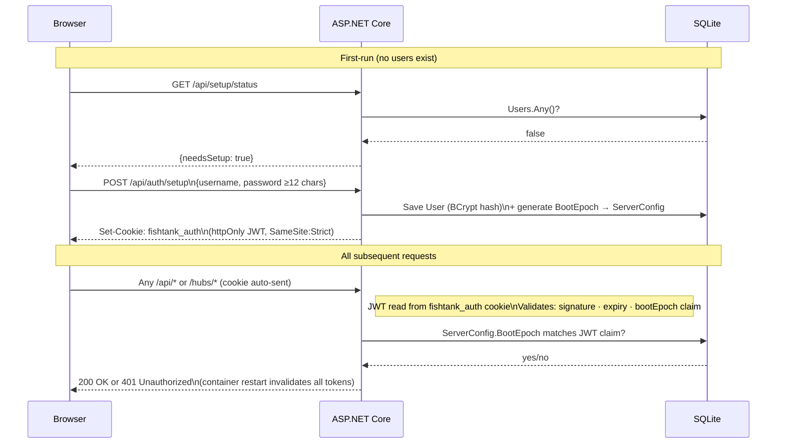
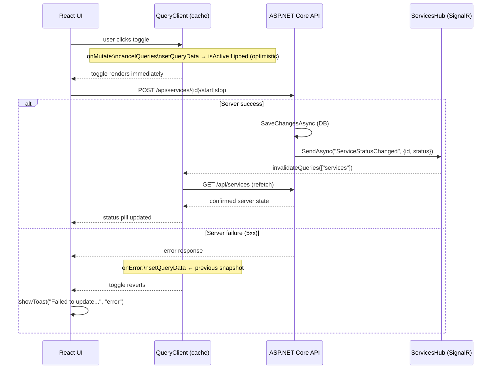

# Fishtank Architecture Diagrams

Mermaid diagrams for the Fishtank application. These render in VS Code Markdown Preview and GitHub.

---

## Deployment Overview

---

## Backend Layer Breakdown

---

## Frontend Layer Breakdown

---

## Authentication & First-Run Flow

---

## Service Toggle — Optimistic Update Flow

